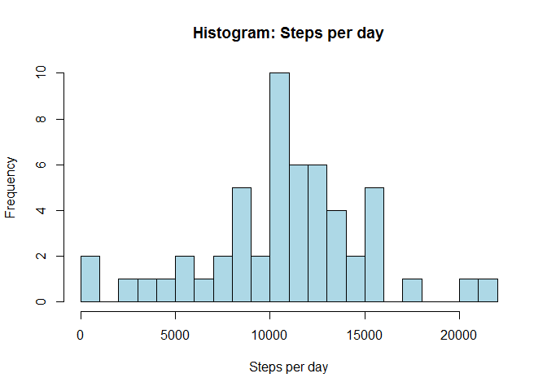
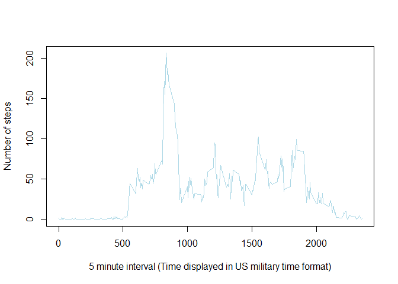
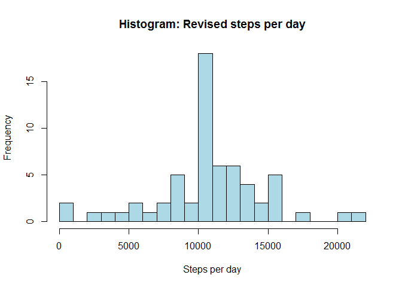
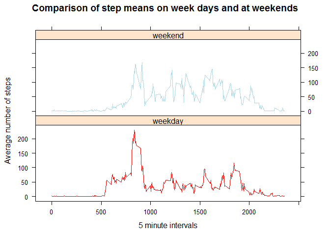

# Reproducible Research: Peer Assessment 1


## Introduction

This assignment is for Coursera/John Hopkins's Reproducible Research Course.

### Instructions given for assignment:
    It is now possible to collect a large amount of data about personal movement using activity monitoring devices such as a Fitbit, Nike Fuelband, or Jawbone Up. These type of devices are part of the “quantified self” movement – a group of enthusiasts who take measurements about themselves regularly to improve their health, to find patterns in their behavior, or because  they are tech geeks. But these data remain under-utilized both because the raw data are hard to obtain and there is a lack of statistical methods and software for processing and interpreting the data.

    This assignment makes use of data from a personal activity monitoring device. This device collects data at 5 minute intervals through out the day. The data consists of two months of data from an anonymous individual collected during the months of October and November, 2012 and include the number of steps taken in 5 minute intervals each day.

## Data

The data for the assessment, activity.csv, can be downloaded from http://github.com/rdpeng/RepData_PeerAssessment1

The activity.csv file should be downloaded to your working directory.


## Loading and preprocessing the data


    Show any code that is needed to
    1.    Load the data (i.e. read.csv())
    2.    Process/transform the data (if necessary) into a format suitable for your analysis


```r
  # check if the file is already there,if not unzip it
  if(!file.exists("activity.csv")){
    unzip("activity.zip")
  }

  # read in the csv file with correct field types set

  activity <- read.csv('activity.csv', header = T, colClasses=c('numeric', 'Date', 'integer'))
```


## What is mean total number of steps taken per day?


    1.    Calculate the total number of steps taken per day
    2.    If you do not understand the difference between a histogram and a barplot, research the difference between them. Make a histogram of the total number of steps taken each day
    3.    Calculate and report the mean and median of the total number of steps taken per day  


The data is recorded at 5 minute intervals over a period of two months, so the first thing to do is to aggregate the number of steps taken with the date so we get the steps-per-day figure. Expectation: 61 results, one per day for 2 months (October = 31 days and November = 30)


```r
  # aggregate activity data by steps and date
  steps_per_day <- aggregate(steps ~ date, activity, sum)
  # check number of observations (expecting 61)
  str(steps_per_day)
```

```
## 'data.frame':	53 obs. of  2 variables:
##  $ date : Date, format: "2012-10-02" "2012-10-03" ...
##  $ steps: num  126 11352 12116 13294 15420 ...
```
There are only 53 observations, rather than the 61 expected.  Print the data to the console to see if we can see why.


```r
steps_per_day
```

```
##          date steps
## 1  2012-10-02   126
## 2  2012-10-03 11352
## 3  2012-10-04 12116
## 4  2012-10-05 13294
## 5  2012-10-06 15420
## 6  2012-10-07 11015
## 7  2012-10-09 12811
## 8  2012-10-10  9900
## 9  2012-10-11 10304
## 10 2012-10-12 17382
## 11 2012-10-13 12426
## 12 2012-10-14 15098
## 13 2012-10-15 10139
## 14 2012-10-16 15084
## 15 2012-10-17 13452
## 16 2012-10-18 10056
## 17 2012-10-19 11829
## 18 2012-10-20 10395
## 19 2012-10-21  8821
## 20 2012-10-22 13460
## 21 2012-10-23  8918
## 22 2012-10-24  8355
## 23 2012-10-25  2492
## 24 2012-10-26  6778
## 25 2012-10-27 10119
## 26 2012-10-28 11458
## 27 2012-10-29  5018
## 28 2012-10-30  9819
## 29 2012-10-31 15414
## 30 2012-11-02 10600
## 31 2012-11-03 10571
## 32 2012-11-05 10439
## 33 2012-11-06  8334
## 34 2012-11-07 12883
## 35 2012-11-08  3219
## 36 2012-11-11 12608
## 37 2012-11-12 10765
## 38 2012-11-13  7336
## 39 2012-11-15    41
## 40 2012-11-16  5441
## 41 2012-11-17 14339
## 42 2012-11-18 15110
## 43 2012-11-19  8841
## 44 2012-11-20  4472
## 45 2012-11-21 12787
## 46 2012-11-22 20427
## 47 2012-11-23 21194
## 48 2012-11-24 14478
## 49 2012-11-25 11834
## 50 2012-11-26 11162
## 51 2012-11-27 13646
## 52 2012-11-28 10183
## 53 2012-11-29  7047
```

There is data missing for 1/10/2012, 8/10/2012, 1/11/2012, 4/11/2012, 9/11/2012, 10/11/2012, 14/11/2012 and 30/11/2012 - which accounts for the missing 8 days.  

The difference between a boxplot and a histogram is described perfectly by Naomi Robbins, " Histograms are used to show distributions of variables while bar charts are used to compare variables. Histograms plot quantitative data with ranges of the data grouped into bins or intervals while bar charts plot categorical data."  
Reference: http://www.forbes.com/sites/naomirobbins/2012/01/04/a-histogram-is-not-a-bar-chart/  


```r
   # create a simple histogram of total number of steps per day
  hist(steps_per_day$steps, 
       main = "Histogram: Steps per day", 
       col = "light blue", 
       breaks = 20,
       xlab = "Steps per day")
```

 

Calculate and report the mean and median:


```r
  mean_steps_per_day <- mean(steps_per_day$steps, na.rm = TRUE)
  mean_steps_per_day
```

```
## [1] 10766.19
```

```r
  median_steps_per_day <- median(steps_per_day$steps, na.rm = TRUE)
  median_steps_per_day
```

```
## [1] 10765
```


## What is the average daily activity pattern?


    1.    Make a time series plot (i.e. type = "l") of the 5-minute interval (x-axis) and the average number of steps taken, averaged across all days (y-axis)
    2.    Which 5-minute interval, on average across all the days in the dataset, contains the maximum number of steps?


```r
  # aggregate activity data by steps and interval and calculate the mean
  steps_by_interval <- aggregate(steps ~ interval, activity, mean)
  # plot it
  plot(steps_by_interval, type="l", 
       col="light blue", 
       xlab="5 minute interval (Time displayed in US military time format)", 
       ylab="Number of steps")
```

 

Use which.max() to work out which 5 minute interval contains the maximum number of steps.  Looking at the plot, the expected answer should be between 0700 and 1000, where we can see the highest peak of over 200 steps.


```r
  steps_by_interval$interval[which.max(steps_by_interval$steps)]
```

```
## [1] 835
```
  
  
      
      
####Observation: 
This shows that the time interval with the highest number of steps is 835, or 08:35 am.  The subject represented by the data my go for a run in the morning,or perhaps walks to work.  There is no corresponding peak at the end of the day so they might take a different mode of transport home again.

    
    

## Imputing missing values


    Note that there are a number of days/intervals where there are missing values (coded as NA). The presence of missing days may introduce bias into some calculations or summaries of the data.  
    
    1.  Calculate and report the total number of missing values in the dataset (i.e. the total number of rows with NAs)  
    
    2.  Devise a strategy for filling in all of the missing values in the dataset. The strategy does not need to be sophisticated. For example, you could use the mean/median for that day, or the mean for that 5-minute interval, etc.  
    
    3.  Create a new dataset that is equal to the original dataset but with the missing data filled in.  
    
    4.  Make a histogram of the total number of steps taken each day and Calculate and report the mean and median total number of steps taken per day. Do these values differ from the estimates from the first part of the assignment? What is the impact of imputing missing data on the estimates of the total daily number of steps?

  
  
#### The number of missing values:


```r
  # calculate how many NAs there are (only occur in the steps field)
  sum(is.na(activity$steps))
```

```
## [1] 2304
```

There are 2304 missing values.

#### Strategy for filling in the missing data: If the missing values are filled in with the daily mean, it could bring the overall values down so it seems like a better idea to use the mean for that time interval, which should echo the plot we already see.


```r
  # create a new copy of the activity data by merging activity and steps_by_interval 
  activity_complete <- merge(activity, steps_by_interval, by="interval", suffixes = c("", ".y"))
  # create a True/False variable to identify whether a step value is NA or not
  NAs <- is.na(activity_complete$steps)
  # Fill the NAs with new data
  activity_complete$steps[NAs] <- activity_complete$steps.y[NAs]
  activity_complete <- activity_complete[ , c(1:3)]
  # Check if there are any NAs in the new dataset
  sum(is.na(activity_complete$steps))
```

```
## [1] 0
```

Create a histogram of the total number of steps taken each day, then calculate and report the new mean and median:


```r
  # recalculate steps by day for this new dataset
  new_steps_per_day <- aggregate(steps ~ date, activity_complete, sum)
  # check no of results
  str(new_steps_per_day)
```

```
## 'data.frame':	61 obs. of  2 variables:
##  $ date : Date, format: "2012-10-01" "2012-10-02" ...
##  $ steps: num  10766 126 11352 12116 13294 ...
```

```r
  # create new histogram 
    hist(new_steps_per_day$steps, 
       main = "Histogram: Revised steps per day", 
       col = "light blue", 
       breaks = 20,
       xlab = "Steps per day")
```

 
  
    
Calculate and report the new mean and median:


```r
  mean_new_steps_per_day <- mean(new_steps_per_day$steps, na.rm = TRUE)
  mean_new_steps_per_day
```

```
## [1] 10766.19
```

```r
  median_new_steps_per_day <- median(new_steps_per_day$steps, na.rm = TRUE)
  median_new_steps_per_day
```

```
## [1] 10766.19
```

#### Observation: The impact of imputing the data seems rather small.  The mean has remained the same while the median has now increased to e the same as the mean.
  
The number of observations has increased from 53 days to the originally expected 61 days of data.
  
      


## Are there differences in activity patterns between weekdays and weekends?


    For this part the weekdays() function may be of some help here. Use the dataset with the filled-in missing values for this part.

    1.    Create a new factor variable in the dataset with two levels – “weekday” and “weekend” indicating whether a given date is a weekday or weekend day.

    2.    Make a panel plot containing a time series plot (i.e. type = "l") of the 5-minute interval (x-axis) and the average number of steps taken, averaged across all weekday days or weekend days (y-axis). See the README file in the GitHub repository to see an example of what this plot should look like using simulated data.


We need a new factor variable to indicate weekday or weekend


```r
  # a new factor variable to indicate weekday or weekend
  Wk_Wkend <- function(dates) {
    wkend_f <- function(date) {
      if (weekdays(date) %in% c("Saturday", "Sunday")) {
        "weekend"
      }
      else {
        "weekday"
      }
    }
    sapply(dates, wkend_f)
  }
  # fill in the new variable field in the new dataset
  activity_complete$wk_wkend <- as.factor(Wk_Wkend(activity_complete$date))
  
  # check
  str(activity_complete)
```

```
## 'data.frame':	17568 obs. of  4 variables:
##  $ interval: int  0 0 0 0 0 0 0 0 0 0 ...
##  $ steps   : num  1.72 0 0 0 0 ...
##  $ date    : Date, format: "2012-10-01" "2012-11-23" ...
##  $ wk_wkend: Factor w/ 2 levels "weekday","weekend": 1 1 2 1 2 1 2 1 1 2 ...
```

```r
  head(activity_complete)
```

```
##   interval    steps       date wk_wkend
## 1        0 1.716981 2012-10-01  weekday
## 2        0 0.000000 2012-11-23  weekday
## 3        0 0.000000 2012-10-28  weekend
## 4        0 0.000000 2012-11-06  weekday
## 5        0 0.000000 2012-11-24  weekend
## 6        0 0.000000 2012-11-15  weekday
```


The next step is to create a new panel plot comparing the averages at the weekend and during the week.  The plot mentioned in the README.md looks like it was created with Lattice.


```r
  # make sure Lattice is loaded
  library(lattice)
    # aggregate activity data by steps, interval and weekend or weekday, then calculate the mean
  new_steps_by_interval <- aggregate(steps ~ interval + wk_wkend, activity_complete, mean)
  # plot it
  xyplot(steps ~ interval | wk_wkend, 
         data=new_steps_by_interval, 
         layout=c(1,2), type="l", 
         group=wk_wkend,
         col=c("red", "light blue"),
         main = "Comparison of step means on week days and at weekends",
         xlab = "5 minute intervals",
         ylab = "Average number of steps")
```

 

